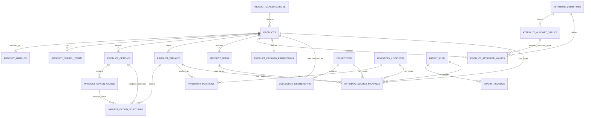

# Vastriqo Phase 2A — Technical Foundation and Product/Catalog Physical Schema

Date: 2026-08-26 (Asia/Kolkata)
Status: **Design complete; awaiting review before any repository initialization or implementation**
Scope: technical foundation and physical Product/Catalog design only

## 1. Purpose and Authority

This document starts Phase 2 and converts the approved Phase 1 conceptual architecture into:

- a technical foundation ADR for `vastriqo-api` and `vastriqo-admin`;
- database-wide physical conventions;
- canonical identity and money decisions;
- an implementation-ready physical Product/Catalog schema;
- storefront read-path and Product admin requirements; and
- a precise readiness gate for the next design/implementation steps.

The following remain authoritative requirements/evidence and are not overwritten here:

- `PHASE-1-CLOSURE-AND-DECISION-REGISTER.md`;
- `PHASE-1-CONCEPTUAL-ARCHITECTURE.md`;
- `PHASE-1-REQUIREMENTS-AND-FEATURE-DISPOSITION.md`;
- `PRODUCT-CATALOG-DESIGN.md`;
- `PHASE-1-FUNCTIONAL-DEPENDENCY-AUDIT.md`;
- `report.md`; and
- `Vastriqo Platform — Project Goal & Phased Direction.md`.

The Phase 1 closure controls whenever an older discovery question differs from a final decision. In particular, Product/Catalog is the first implementation vertical; native collections and the minimum inventory boundary are part of that vertical; Shopify/BMS identities remain external; and current test-era customer/order/auxiliary records are outside migration scope.

No application repository, source code, physical migration, database, package installation, infrastructure or external data is created or changed by this document.

## 2. Evidence Reviewed

### 2.1 Repository evidence

The review covered the current application structure and relevant configuration/code paths, including:

- `vastriqo/package.json`, `tsconfig.json`, `next.config.ts`, environment configuration, Shopify catalog client and product consumers;
- `bms-api/package.json`, TypeScript/ESLint configuration, Express bootstrap, configuration loading, Knex connection/migrations, logging, response/error helpers, transactions, validation, Product services and Shopify collection persistence;
- `bms-admin/package.json`, React Router/Vite setup, API hooks, Axios configuration, authentication helpers, protected routing, Product forms/lists and Shopify collection workflows; and
- every Phase 1 architecture/decision document listed in §1.

### 2.2 Version/support evidence

The selected major lines are compatible with the current project ecosystem and supported upstream:

- [Node.js 24 is an LTS line](https://nodejs.org/en/download/archive/v24);
- [NestJS 11 requires Node.js 20 or newer and recommends current LTS](https://docs.nestjs.com/migration-guide);
- [Next.js 16 requires Node.js 20.9 or newer](https://nextjs.org/docs/app/guides/upgrading/version-16);
- [PostgreSQL 18 is the current supported major and includes native `uuidv7()`](https://www.postgresql.org/docs/18/release-18.html);
- [Nest provides first-party OpenAPI document generation](https://docs.nestjs.com/openapi/introduction); and
- [Kysely is a TypeScript SQL query builder with PostgreSQL support](https://github.com/kysely-org/kysely).

Exact dependency patches are resolved and pinned when repository initialization is explicitly authorized. Major lines are fixed here so patch resolution is a mechanical lockfile task, not a renewed architecture choice.

## 3. Repository Convention Assessment

| Existing convention/pattern | Decision | Reason |
| --- | --- | --- |
| Node.js and strict TypeScript in all applications | **Retain** | Shared project knowledge, suitable ecosystem and Phase 1 decision. Raise compiler strictness rather than copying BMS's loose types. |
| npm with committed `package-lock.json` | **Retain** | All three repositories use npm; no evidence justifies introducing another package manager. |
| React, Ant Design and typed frontend code | **Retain selectively** | Fits the future admin and current storefront visual ecosystem. Use current major lines and accessible theme conventions. |
| TanStack Query API hooks in BMS admin | **Retain concept** | Appropriate server-state ownership, query keys, invalidation and mutation states. Do not copy hook implementations or response assumptions. |
| Central API client | **Retain concept** | One environment-aware, generated-contract-aware transport boundary is useful. Reject hard-coded URLs and localStorage token injection. |
| Route/controller/service separation | **Retain intent, replace structure** | Transport/application/persistence separation is useful, but BMS controllers, global services and transaction side effects do not define target module boundaries. |
| Explicit relational migrations | **Retain** | Repeatable versioned DDL is required; target migrations use the selected PostgreSQL/Kysely conventions rather than copying MySQL DDL. |
| React Router/Vite SPA for BMS admin | **Do not copy automatically** | It works as a UI reference, but the target admin needs a server/BFF session boundary. The existing storefront's Next.js expertise is more relevant. |
| Express 5 familiarity | **Retain as HTTP adapter only** | Express remains technically appropriate and locally familiar, but NestJS owns modules, dependency injection, validation, error handling and lifecycle. |
| MySQL/Knex schema and global `knexInstance` | **Reject as target** | It carries BMS coupling and global state; the target needs PostgreSQL constraints/search and injected transaction-scoped persistence. |
| Request-global transactions and response helpers that commit/rollback | **Reject** | Transaction ownership belongs to an application use case, not middleware or response serialization. Current code can double commit/rollback. |
| `any`-heavy controllers/responses and global types | **Reject** | Conflicts with strict contracts and allows runtime/schema drift. |
| Secret defaults/hard-coded encryption material and permissive fallback config | **Reject** | Missing security configuration must fail startup; secrets never have development-looking production defaults. |
| `cors({ origin: '*' })`, 100 MB global JSON bodies | **Reject** | Origins, methods and payload limits must be explicit per environment/use case. |
| Raw SQL/binding logging and token/customer logging | **Reject** | Logs must be structured and redacted; query timing may be logged without values. |
| Local file rotation inside the process | **Reject for production** | Emit structured JSON to stdout/stderr; deployment/logging infrastructure owns retention. |
| Browser `localStorage` bearer/admin token and token-presence route guard | **Reject** | Target uses server-revocable, HttpOnly cookie/BFF topology and API authorization. |
| Hard-coded production API URL in admin | **Reject** | Server-validated environment configuration and same-origin BFF paths replace it. |
| Client-side list-all-then-filter and arbitrary 1,000-row fetch | **Reject** | Catalog/admin filtering, sorting and pagination are server-side. |
| No established automated test runner | **Correct immediately** | Unit, integration, contract and e2e tests are repository initialization requirements. |

## 4. ADR 2A-001 — `vastriqo-api` Technical Foundation

### 4.1 Decision

`vastriqo-api` will be a separate Node.js modular-monolith service with this baseline:

| Concern | Decision |
| --- | --- |
| Runtime | Node.js **24 LTS**, pinned to an exact 24.x patch in repository tooling/container files. |
| Language | TypeScript **6.x**, strict, native ESM, `NodeNext` resolution, ES2023 target. |
| Framework | NestJS **11.x** with the Express 5 adapter. |
| Package manager | npm 11.x; committed lockfile; `npm ci` in CI/builds. |
| Database | PostgreSQL **18.x**; production starts on the latest approved 18.x security patch. |
| Query layer | Kysely **0.29.x** with the `pg` driver; SQL remains visible and reviewable. |
| Migrations | Kysely Migrator invoked by a repository-owned TypeScript command, with committed ordered migration files and raw SQL where PostgreSQL-specific DDL is clearer. |
| Transport validation | Nest DTOs with `class-validator`/`class-transformer`; global whitelist/forbid-unknown validation. Domain invariants are also enforced below transport. |
| Configuration | `@nestjs/config` plus a single boot-time Zod schema; fail closed on missing/invalid values. |
| Logging | Pino-compatible structured JSON to stdout/stderr, request correlation IDs and mandatory redaction. |
| Errors | One global exception boundary returning RFC 9457-style problem details with stable application error codes. |
| API contract | OpenAPI 3.1 generated from reviewed transport contracts; CI validates and detects breaking changes. |
| Testing | Vitest, `@nestjs/testing`, Supertest, Testcontainers PostgreSQL and contract/OpenAPI checks. |
| Jobs | Same repository, separate worker entrypoint; PostgreSQL-backed durable queue/outbox selected before the first asynchronous workflow. No Redis requirement at initialization. |
| Deployment unit | One API image and, when required, the same image with a worker command. Exact cloud topology remains separate. |

NestJS is selected for explicit modules, dependency injection, lifecycle/error/validation conventions and first-party OpenAPI integration. Express is retained only as the adapter because it is locally understood and no measured workload justifies introducing Fastify-specific behavior. Kysely is selected instead of a stateful ORM so schema constraints and SQL query plans remain first-class; it is not permission to scatter query-builder calls through controllers.

### 4.2 Module and source structure

```text
src/
  main.ts
  app.module.ts
  modules/
    catalog/
      domain/
      application/
      infrastructure/
      transport/http/
    merchandising/
    inventory/
    import/
    admin-identity/          # when its phase starts
  platform/
    config/
    database/
    http/
    logging/
    jobs/
    observability/
  generated/                # generated artifacts only, never domain source
migrations/
test/
  integration/
  contract/
  e2e/
  fixtures/
```

Rules:

1. A domain module owns its tables, commands, invariants and public application interfaces.
2. Transport depends on application; application depends on domain; infrastructure implements ports. Domain code does not import Nest, Kysely or provider SDKs.
3. Cross-module writes call an application interface; they do not query another module's tables opportunistically.
4. Controllers never begin/commit/rollback transactions and never contain query logic.
5. Repositories receive an explicit database/transaction context. No global mutable query instance is available to feature code.
6. OpenAPI DTOs are transport contracts, not persistence rows and not Shopify/BMS response shapes.
7. Public, customer, admin, integration and import controllers remain visibly separated even when deployed in one service.

### 4.3 Package and dependency policy

- Direct dependencies are exact-pinned; transitive versions are fixed by `package-lock.json`.
- Node/npm versions are pinned through repository metadata and CI/container configuration.
- `npm ci` is the only CI/production install path.
- No runtime dependency is added without an owner, use case, license/security review and removal criterion where temporary.
- Separate repositories do not use unpublished shared source packages. Contracts cross repositories through versioned OpenAPI artifacts/generated clients.
- Scripts must include at least build, typecheck, lint, format-check, unit test, integration test, e2e test, OpenAPI check, migration status and migration apply.
- Dependency automation may propose updates, but major upgrades require an ADR/change review and passing contract/database tests.

### 4.4 Configuration and secrets

- Environment variables are parsed once at startup into a typed immutable configuration object.
- Missing secrets, database URL, allowed origins or cryptographic settings fail startup. There are no fallback JWT secrets, credentials, domains or encryption keys.
- `.env.example` contains names and safe placeholders only. Local `.env` files are untracked.
- Public configuration is explicitly allow-listed; server secrets never use public-prefixed variables.
- Development, test, staging and production are distinct validated configurations. `NODE_ENV` is not overloaded as the complete environment model.

### 4.5 Logging, errors and observability

- Logs are newline-delimited JSON with timestamp, level, service, environment, request/correlation ID, operation and safe entity IDs.
- Redact authorization/cookies, passwords, tokens, secret keys, payment data, address/contact PII and source payloads. SQL bindings are never logged in production.
- Expected domain errors map to stable problem `type`, `code`, status, safe title/detail and field violations. Unknown errors return a generic 500 with correlation ID.
- Health has liveness and dependency-aware readiness; readiness does not conceal migration/database failure.
- Metrics initially cover latency/error rate, DB pool, catalog query time, import failures and job depth. Provider-specific telemetry waits for its module.

### 4.6 Testing structure

| Test level | Required proof |
| --- | --- |
| Domain unit | Publication eligibility, option combinations, money, handle changes and sellability rules without framework/database. |
| Application unit | Command orchestration, authorization decisions, idempotency and error mapping with ports replaced. |
| Database integration | Real PostgreSQL 18 migrations, constraints, transactions, queries, indexes and concurrency through Testcontainers. |
| HTTP integration | Validation, status/problem contracts, pagination/cursors and authorization with the Nest application. |
| OpenAPI contract | Generated document is valid, committed/compared and compatible with intended storefront/admin clients. |
| E2E | Representative Product admin command -> database -> public read projection. |
| Migration | Deterministic source fixtures, excluded-class assertions and identical-rerun proof. |

### 4.7 Background jobs

- Asynchronous work runs from a separate worker entrypoint in `vastriqo-api`; it does not execute unbounded work inside an HTTP request.
- A PostgreSQL-backed durable queue and transactional outbox are the default boundary so committing domain state and scheduling its follow-up are atomic. The exact maintained package is selected and recorded before the first asynchronous workflow is implemented.
- Jobs have a stable type, versioned bounded payload, idempotency key, attempt count, availability time and terminal/dead-letter outcome. Payloads reference native IDs rather than copying full Product/source documents.
- Handlers are idempotent, use bounded exponential retry for transient failures and classify permanent validation/provider failures without endless retry.
- Network/provider calls occur only after the originating transaction commits. Results are recorded and reconciled in a new bounded transaction.
- Initial Product uses include media copying and bulk projection repair/import orchestration; ordinary Product commands keep the public projection synchronous.
- No Redis, broker or separate worker repository is required at initialization. Measurements or provider constraints may justify one later without changing domain ownership.

## 5. ADR 2A-002 — `vastriqo-admin` Technical Foundation

### 5.1 Decision

| Concern | Decision |
| --- | --- |
| Framework | Next.js **16.x** App Router running on Node.js 24 LTS; this is a separate repository/application. |
| UI runtime | React **19.x**, TypeScript 6.x strict. |
| Component system | Ant Design **6.x** with Vastriqo theme tokens and accessibility review. Do not fork BMS styling/code. |
| Server state | TanStack Query **5.x** for cache/invalidation where client interaction benefits; server components may read directly through the BFF. |
| API client | Generated OpenAPI types/client (`openapi-typescript`/`openapi-fetch` class of tooling) behind one server-aware transport. No handwritten duplicate DTO catalogue. |
| Forms | React Hook Form plus Zod schemas derived/aligned with the OpenAPI contract; aggregate errors remain visible. |
| Local state | Component state and URL search parameters first. No Redux/global store until a proven cross-route client-state need exists. |
| Authentication | Same-origin Next BFF with opaque API session in Secure, HttpOnly, SameSite cookie; never localStorage. |
| Testing | Vitest + React Testing Library for components/hooks; Playwright for authenticated Product workflows and accessibility-critical paths. |
| Build/deploy | Node server/container, reproducible `npm ci` + `next build`; environment is server-validated and API origin is not hard-coded in browser code. |

Next.js is chosen because the current Vastriqo team/repository already uses its server/browser boundary, React 19 and Ant Design, and because a server-side BFF materially improves the admin session topology. The BMS admin remains a workflow reference only.

### 5.2 Project structure

```text
app/
  (public)/login/
  (authenticated)/products/
  api/                    # narrow same-origin BFF routes only
features/
  products/
    components/
    forms/
    queries/
    mutations/
    schemas/
components/
lib/
  api/
  auth/
  config/
  errors/
generated/openapi/
test/
e2e/
```

- Feature code owns screens/forms/query keys, not transport authentication.
- The generated client is never edited manually.
- Domain rules remain server-authoritative; client validation exists for usability only.
- Tables always use server pagination/filter/sort. Large lists are never fetched wholesale for browser filtering.
- Mutations surface field errors, aggregate conflicts and stale-version responses without replacing server data silently.

### 5.3 Admin session topology

```text
Admin browser
   | same-origin HTTPS + HttpOnly cookie + CSRF protection
   v
vastriqo-admin Next.js BFF
   | server-to-server request carrying opaque session credential
   v
vastriqo-api admin surface
   |
   v
server-side revocable AdminSession
```

The cookie is scoped to the admin host, Secure, HttpOnly and SameSite=Lax or stricter. State-changing BFF requests require an allowed Origin and CSRF token. The API stores only a hash of the opaque session secret and enforces admin authorization for every operation. Customer and BMS sessions, cookies, JWT secrets and tables are not shared.

## 6. ADR 2A-003 — Database Foundation

### 6.1 Engine and logical ownership

Use PostgreSQL 18.x with one dedicated Vastriqo database. PostgreSQL is chosen for transactional integrity, rich constraints, `timestamptz`, native UUIDv7 generation, partial/functional indexes, full-text search and `pg_trgm`, all of which directly serve the approved domain. MySQL compatibility is not a requirement.

Module-owned schemas make ownership visible without creating separate databases:

- `catalog` — products, handles, variants, options, media, attributes and derived public catalog projection;
- `merchandising` — collections and ordered membership;
- `inventory` — locations and positions in Phase 2A;
- `migration` — import runs, records and external mappings; and
- `platform` — later cross-cutting outbox/job/audit infrastructure.

Cross-schema foreign keys are allowed inside this modular monolith where a required relationship exists. Direct cross-module writes remain prohibited at the application layer.

### 6.2 Physical conventions

| Topic | Decision |
| --- | --- |
| Naming | Unquoted lower `snake_case`; plural table names; singular column names; explicit `pk_`, `fk_`, `uq_`, `ck_`, `ix_` names. |
| Primary key | `uuid NOT NULL DEFAULT uuidv7()`; no auto-increment IDs and no Shopify/BMS IDs. |
| API identity | The same canonical lowercase UUID is used in API contracts. Product public navigation uses handles. No duplicate public-ID column in this phase. |
| Foreign keys | Same type as target PK; `ON DELETE RESTRICT` by default. Use `CASCADE` only for records wholly owned by an aggregate (for example option values after an approved option deletion). |
| Timestamps | `timestamptz`, stored/operated in UTC; API uses RFC 3339 UTC strings. Date-only business concepts later use `date`, never midnight timestamps. |
| Audit timestamps | Mutable rows have `created_at` and `updated_at`; database default for creation, application transaction explicitly updates `updated_at`. No hidden generic update trigger. |
| Soft delete | No universal `deleted_at`. Products/variants/collections use explicit lifecycle states; aliases may retire. Hard delete is restricted to unreferenced drafts/owned children through explicit commands. |
| Optimistic concurrency | Mutable aggregate roots have `lock_version bigint NOT NULL DEFAULT 0`; writes compare supplied version and increment atomically. |
| Uniqueness | Normalize business keys before write, store normalized forms where useful, and enforce database unique constraints/partial indexes. Empty strings are rejected or normalized to `NULL`. |
| Indexing | Add indexes for documented reads, joins, uniqueness and FK access; no speculative index-every-column policy. Verify with `EXPLAIN (ANALYZE, BUFFERS)` against representative data. |
| Enums | Use `varchar/text` plus named `CHECK` constraints for small application lifecycle sets. Use tables for admin-managed vocabularies. Avoid PostgreSQL enum types because adding/removing values complicates reversible delivery. |
| JSON | Not allowed for Product/Variant/Option/Attribute business state. `jsonb` is limited to immutable import manifests/diagnostic details and external-event/outbox payloads with bounded retention. |
| Extensions | `pg_trgm` is required for indexed substring-compatible catalog search. No external search engine in Phase 2A. |
| Encoding/collation | UTF-8; normalized slugs/codes use ASCII rules; human text uses an explicitly selected deterministic database collation validated before provisioning. |

### 6.3 Migration strategy

1. Migration filenames are immutable UTC timestamp plus description; each has a unique version.
2. Migrations are reviewed alongside the schema/design change and committed to `vastriqo-api`.
3. The application never auto-migrates at web-process startup. A single controlled release step obtains an advisory lock and applies pending migrations.
4. Shared/staging/production changes are forward-only. Destructive rollback uses a corrective migration or verified restore/roll-forward plan, not an unsafe automatic `down`.
5. Expand/contract changes preserve compatibility during rolling releases: add/backfill/read-switch/constraint/write-switch/remove in separate releases where needed.
6. Every migration is tested from empty and from the previous released schema using PostgreSQL 18.
7. Schema status/checksum is observable; release fails on unexpected drift.
8. No physical migration is created by this Phase 2A document.

### 6.4 Transaction and concurrency rules

- One Product aggregate command owns one transaction covering Product, handles, options/values, variants/selections, media, attributes, the derived catalog projection and outbox record.
- Collection membership/order commands transact under a locked Collection aggregate/version.
- Inventory quantity changes use atomic statements or `SELECT ... FOR UPDATE` on the exact Position rows; later reservation/movement records update with the balance in the same transaction.
- Import operates in bounded per-aggregate transactions under unique external mappings. It never holds one transaction across a network request or an entire import run.
- External provider calls never occur while a database transaction is open. Persist intent/outbox state, commit, call asynchronously, and reconcile.
- Read Committed is the default. Use explicit row locks or serializable/retry only for a demonstrated invariant; do not globally raise isolation.

## 7. ADR 2A-004 — Money and Pricing

### 7.1 Canonical representation

Catalog prices use integer minor units:

```text
price_minor: 129900
currency_code: "INR"
API amount: "1299.00"
```

| Concern | Decision |
| --- | --- |
| Storage | Signed `bigint` minor units plus `char(3)` uppercase ISO 4217 currency code. Catalog constraints require amount `>= 0`; publication requires a positive eligible price. |
| Currency exponent | Application-owned reviewed currency metadata. INR uses exponent 2. No database default silently assumes INR; every write supplies currency. |
| Current scope | A published Product's active variants must use one currency. Initial migration is expected to be INR but production validation must prove it. |
| Input | Accept a decimal string plus currency. Reject excess fractional precision for catalog price entry rather than silently round it. |
| API output | `{ amount: "1299.00", currency: "INR" }`. Decimal amount is a JSON string so JavaScript never loses integer precision. Minor units may appear only in authorized internal contracts that serialize safely. |
| Comparison | Compare minor units only when currency codes match. Cross-currency comparison/conversion is unsupported. |
| Multiplication | Quantity multiplication uses integer arithmetic with overflow checks. |
| Rounding | No rounding occurs for stored catalog-price input. Later tax/discount division must declare a rule; default engineering candidate is half-up at the affected currency exponent, subject to legal/provider rules. |
| Compare-at | Not stored in Phase 2A because the current storefront does not display it. Add a deliberate price-type/history model later if a real promotion requirement is approved. |

Integer minor units are selected over binary floating point and over an unconstrained decimal because catalog comparison/sorting is exact and current storefront amounts have explicit currency. The API remains close to the current storefront's decimal-string consumption without copying Shopify's object shape.

## 8. ADR 2A-005 — Native Identity, Handles and External Mappings

### 8.1 Native identity

- Every native entity uses PostgreSQL UUIDv7. Database generation is the default; APIs never accept a Shopify/BMS ID in a native ID field.
- The UUID is also the API identifier for Product, Variant, Collection and other non-secret resources. Authorization, not ID obscurity, protects admin/customer data.
- Human order numbers and other later public references remain separate domain concepts.

### 8.2 Product handles

Handles are lowercase ASCII slugs, 1–160 characters, matching `^[a-z0-9]+(?:-[a-z0-9]+)*$`. All canonical and historical handles live in one `catalog.product_handles` table so a historical alias cannot collide with another Product's current handle.

Every native Product is created with exactly one active canonical handle, including while draft or retired. Public resolution still requires a published Product. Changing the handle in one Product transaction:

1. inserts the new canonical handle after global uniqueness validation;
2. demotes the prior canonical row to an active alias;
3. retains the alias for redirect continuity; and
4. rebuilds the public projection/sitemap timestamp.

Public resolution of an active alias returns a permanent redirect to the current canonical handle. Aliases are not silently deleted during import.

### 8.3 External mappings

`migration.external_source_mappings` is the only persistent source-identity registry. Its key is `(source_system, source_entity_type, external_id)`. The table uses nullable, typed Product-slice target FKs plus a `num_nonnulls(...) = 1` check rather than a polymorphic target ID without referential integrity.

Mappings exist only for included Product/Catalog, Collection, Media and Inventory-location records. Current test customers, addresses, wishlists, orders, inquiries and newsletter rows get neither target records nor mappings.

## 9. Product/Catalog Physical Design

### 9.1 Table-selection rule

Tables exist only where independent identity, cardinality, integrity, ordering, lifecycle, querying or migration provenance requires them. The design deliberately does **not** create tables for Shopify products/metafields/metaobjects, generic metadata, arbitrary tags, brand/vendor, compare-at prices, barcode/weight, variant media, SEO overrides, promotions or a generic CMS.

The Product aggregate is relational because options, variant combinations, ordered media, typed specifications, collection membership, inventory positions and source mappings have distinct constraints and query paths. A single Product JSON document would lose those guarantees.

### 9.2 Relationship diagram



### 9.3 Common column shorthand

The table specifications below use:

- `id`: `uuid NOT NULL DEFAULT uuidv7()` unless a natural/composite key is explicitly selected;
- `created_at`: `timestamptz NOT NULL DEFAULT statement_timestamp()`;
- `updated_at`: `timestamptz NOT NULL DEFAULT statement_timestamp()` for mutable rows; and
- `lock_version`: `bigint NOT NULL DEFAULT 0` on mutable aggregate roots.

“Check” means a named PostgreSQL `CHECK` constraint. All text inputs are trimmed; empty optional values become `NULL`.

## 10. Catalog Tables

### 10.1 `catalog.product_classifications`

Purpose: native controlled classification used for the current Category filter/card badge without copying arbitrary Shopify `productType` strings.

| Column | Type/nullability | Meaning |
| --- | --- | --- |
| `id` | UUID PK | Native classification identity. |
| `code` | `varchar(64) NOT NULL` | Stable lowercase machine code. |
| `name` | `varchar(120) NOT NULL` | Admin/customer display name. |
| `status` | `varchar(16) NOT NULL DEFAULT 'active'` | `active` or `retired`. |
| `position` | `integer NOT NULL DEFAULT 0` | Facet/admin ordering; non-negative. |
| `lock_version` | bigint NN | Optimistic concurrency. |
| timestamps | timestamptz NN | Audit/update time. |

Constraints/indexes:

- PK `id`; unique `code`; check lowercase code syntax; check status and non-negative position.
- Index `(status, position, id)` for filter vocabulary/admin reads.
- A Product may have no classification while draft. Publication mapping should require one only if production/current behavior validation establishes complete classification coverage.

### 10.2 `catalog.products`

Purpose: Product aggregate root and publication/content owner.

| Column | Type/nullability | Meaning/admin ownership |
| --- | --- | --- |
| `id` | UUID PK | System-controlled native identity. |
| `classification_id` | UUID NULL FK | Admin-editable normalized classification. |
| `title` | `varchar(240) NOT NULL` | Admin-editable; non-blank. |
| `description_text` | `text NULL` | Search/fallback text; derived from rich content or admin-edited plain copy. |
| `description_html` | `text NULL` | Sanitized rich product description only. Raw source HTML is never trusted. |
| `publication_status` | `varchar(16) NOT NULL DEFAULT 'draft'` | `draft`, `published`, or `retired`. |
| `published_at` | `timestamptz NULL` | Current/most recent publication time; system-controlled transition output. |
| `merchandising_at` | `timestamptz NULL` | Deliberate stable new-arrival/default-sort timestamp; admin/import initialized. |
| `retired_at` | `timestamptz NULL` | Set only while retired. |
| `lock_version` | bigint NN | Product aggregate concurrency token. |
| timestamps | timestamptz NN | Created/updated; updated feeds sitemap/projection. |

Constraints/indexes:

- FK classification uses `ON DELETE RESTRICT`; index `classification_id`.
- Checks enforce nonblank title and lifecycle/timestamp consistency.
- Partial index `(merchandising_at DESC, id DESC) WHERE publication_status = 'published'` supports default/new listing.
- Index `(updated_at DESC, id DESC) WHERE publication_status = 'published'` supports sitemap/delta reads.
- A published Product needs a canonical handle, at least one active valid Variant and a positive price. Missing media is a warning, not a database publication prohibition, matching Phase 1.
- `published -> draft` is unpublish; `draft|published -> retired` removes it from public reads. Restore is an explicit `retired -> draft` command, never a direct status edit.

SEO title/description are generated from current native title/description as the storefront does today. Optional SEO override columns are deliberately absent until a real requirement/data review activates them.

### 10.3 `catalog.product_handles`

Purpose: one collision-free namespace for canonical handles and redirect aliases.

| Column | Type/nullability | Meaning |
| --- | --- | --- |
| `handle` | `varchar(160) PRIMARY KEY` | Normalized public slug; natural key is intentional. |
| `product_id` | UUID NN FK | Owning Product. |
| `is_canonical` | `boolean NOT NULL` | True for the current handle. |
| `retired_at` | `timestamptz NULL` | Null means resolvable; set only for deliberately disabled aliases. |
| `created_at` | timestamptz NN | When this handle entered the registry. |

Constraints/indexes:

- Check slug regex/lowercase; FK Product `ON DELETE RESTRICT`.
- Partial unique `(product_id) WHERE is_canonical AND retired_at IS NULL`.
- Index `(product_id, is_canonical)` for Product detail/admin joins.
- Application invariant: every Product has exactly one active canonical row; a check prevents a canonical row from being retired. The single PK namespace prevents alias/current collisions across Products.

### 10.4 `catalog.product_search_terms`

Purpose: approved normalized discovery synonyms needed to preserve search meaning without retaining raw Shopify tags/vendor fields as domain columns.

| Column | Type/nullability | Meaning |
| --- | --- | --- |
| `product_id` | UUID NN FK | Owning Product. |
| `term` | `varchar(160) NOT NULL` | Human-readable approved search term. |
| `normalized_term` | `varchar(160) NOT NULL` | Lowercase/search-normalized term. |
| `position` | `integer NOT NULL DEFAULT 0` | Stable admin/import order. |
| timestamps | timestamptz NN | Provenance/update aid. |

PK/constraints/indexes:

- Composite PK `(product_id, normalized_term)`; check nonblank term and non-negative position.
- Index `(normalized_term, product_id)` supports reconciliation/admin exact lookup.
- Raw Shopify tags are staged and mapped only when approved; they are not inserted blindly.

### 10.5 `catalog.product_options`

Purpose: ordered selectable dimensions owned by a Product.

| Column | Type/nullability | Meaning |
| --- | --- | --- |
| `id` | UUID PK | Native option identity. |
| `product_id` | UUID NN FK | Owning Product. |
| `code` | `varchar(64) NOT NULL` | Normalized per-Product code such as `size` or `color`; not globally hard-coded. |
| `name` | `varchar(120) NOT NULL` | Display label. |
| `position` | `smallint NOT NULL` | Selector order, starting at zero. |
| timestamps | timestamptz NN | Audit/update time. |

Constraints/indexes:

- Unique `(product_id, code)` and `(product_id, position)`; non-negative position.
- Unique support key `(id, product_id)` for composite selection FKs.
- Index `(product_id, position, id)` is the ordered detail path.
- Removing/reordering an option is a Product aggregate command. Removal is rejected while selections use it unless variants are deliberately rebuilt in the same transaction.

### 10.6 `catalog.product_option_values`

Purpose: ordered values belonging to exactly one Product option.

| Column | Type/nullability | Meaning |
| --- | --- | --- |
| `id` | UUID PK | Native value identity. |
| `option_id` | UUID NN FK | Owning option. |
| `value` | `varchar(160) NOT NULL` | Display value. |
| `normalized_value` | `varchar(160) NOT NULL` | Comparison/import-normalized value. |
| `position` | `smallint NOT NULL` | Selector order. |
| timestamps | timestamptz NN | Audit/update time. |

Constraints/indexes:

- Unique `(option_id, normalized_value)` and `(option_id, position)`; unique `(id, option_id)` supports a composite FK.
- Index `(option_id, position, id)` for detail reads.
- Values referenced by a Variant cannot be deleted; rename/mapping is explicit.

### 10.7 `catalog.product_variants`

Purpose: native purchasable combination, price and product-facing inventory policy.

| Column | Type/nullability | Meaning/admin ownership |
| --- | --- | --- |
| `id` | UUID PK | Native purchasable identity. |
| `product_id` | UUID NN FK | Owning Product. |
| `title` | `varchar(240) NULL` | Optional display override; normally derived from selections. |
| `sku` | `varchar(120) NULL` | Optional normalized operational identifier; production coverage still requires validation. |
| `status` | `varchar(16) NOT NULL DEFAULT 'active'` | `active` or `retired`. |
| `position` | `integer NOT NULL DEFAULT 0` | Stable variant/admin order. |
| `option_signature` | `char(64) NOT NULL` | System-generated SHA-256 of canonical sorted option/value UUID pairs. |
| `price_minor` | `bigint NOT NULL` | Exact current price, non-negative. |
| `currency_code` | `char(3) NOT NULL` | Uppercase ISO code; explicit, no default. |
| `inventory_mode` | `varchar(16) NOT NULL DEFAULT 'tracked'` | `tracked` or `not_tracked`; validate actual source use. |
| `oversell_policy` | `varchar(16) NOT NULL DEFAULT 'deny'` | `deny` or `continue`; import `continue` only where production proves it. |
| timestamps | timestamptz NN | Audit/update time. |

Constraints/indexes:

- FK Product `ON DELETE RESTRICT`; unique `(product_id, option_signature)` prevents duplicate combinations.
- Unique `(id, product_id)` supports composite selection FKs.
- Partial case-normalized unique SKU index where SKU is not null; blank becomes null. If validation finds legitimate duplicates, import reports them rather than weakening native identity silently.
- Checks cover status, position, non-negative price, uppercase currency and inventory policies.
- Index `(product_id, status, position, id)` for detail; `(product_id, currency_code, price_minor, id) WHERE status = 'active'` for price projection.
- Every active Variant selects one value for every current Product option. A no-option Product has exactly one Variant whose signature is the empty-selection sentinel hash.
- `option_signature` is derived integrity support, not source data. Application writes selections and signature atomically and reconciliation recomputes it.
- All active Variants of a publishable Product use one currency in Phase 2A.

### 10.8 `catalog.variant_option_selections`

Purpose: normalized Variant-to-option-value selection with same-Product enforcement.

| Column | Type/nullability | Meaning |
| --- | --- | --- |
| `product_id` | UUID NN | Redundant integrity key. |
| `variant_id` | UUID NN | Selected Variant. |
| `option_id` | UUID NN | Product option/dimension. |
| `option_value_id` | UUID NN | Selected value belonging to the option. |
| `created_at` | timestamptz NN | Audit time. |

Constraints/indexes:

- PK `(variant_id, option_id)` prevents two values for one Variant dimension.
- Composite FK `(variant_id, product_id)` -> Variant; `(option_id, product_id)` -> ProductOption; `(option_value_id, option_id)` -> ProductOptionValue.
- Index `(option_value_id, product_id, variant_id)` supports Color/Size filters/facets.
- Index `(product_id, option_id, option_value_id)` supports Product-level facet reads.

### 10.9 `catalog.product_media`

Purpose: ordered native Product image references, featured image and optional validated product-wide card override.

| Column | Type/nullability | Meaning/admin ownership |
| --- | --- | --- |
| `id` | UUID PK | Native media relation identity. |
| `product_id` | UUID NN FK | Owning Product. |
| `asset_key` | `varchar(1024) NOT NULL` | Provider-independent native object key/path, not an external Shopify URL. |
| `alt_text` | `varchar(500) NULL` | Admin/import value; API falls back to Product title. |
| `usage` | `varchar(24) NOT NULL DEFAULT 'gallery'` | `gallery` or `card_override`. |
| `is_featured` | `boolean NOT NULL DEFAULT false` | Featured within gallery. |
| `position` | `integer NOT NULL DEFAULT 0` | Stable gallery order. |
| `status` | `varchar(16) NOT NULL DEFAULT 'active'` | `active` or `retired`; retirement preserves source mapping/provenance. |
| `retired_at` | `timestamptz NULL` | Set only when retired. |
| timestamps | timestamptz NN | Audit/update time. |

Constraints/indexes:

- Unique `(id, product_id)` for projection composite FKs.
- Unique `(product_id, position) WHERE usage = 'gallery' AND status = 'active'`.
- Unique `(product_id) WHERE usage = 'gallery' AND is_featured AND status = 'active'`.
- Unique `(product_id) WHERE usage = 'card_override' AND status = 'active'`; card override cannot also be featured.
- Checks cover usage/status, non-negative position, lifecycle timestamp consistency, and require retired rows not to remain featured.
- Ordered index `(product_id, usage, status, position, id)`.
- Product-wide `card_override` rows are imported only if production validation confirms actual BMS differences/use. No collection-membership media column is created.
- Admin “remove” retires the relation; a later cleanup may hard-delete only an unmapped, unreferenced retired row through an explicit operation.
- Source URL, Shopify media ID, copy checksum and import failure belong to migration staging/records, not `asset_key`.

### 10.10 `catalog.attribute_definitions`

Purpose: governed native specification vocabulary, not a generic Shopify metafield catalogue.

| Column | Type/nullability | Meaning/admin ownership |
| --- | --- | --- |
| `id` | UUID PK | Native definition identity. |
| `code` | `varchar(80) NOT NULL` | Stable lowercase business code such as `fabric`. |
| `label` | `varchar(160) NOT NULL` | Public/admin label. |
| `value_mode` | `varchar(16) NOT NULL` | `text` or `controlled`. |
| `cardinality` | `varchar(16) NOT NULL` | `single` or `multiple`. |
| `is_public` | `boolean NOT NULL DEFAULT true` | Included in Product detail specifications. |
| `is_filterable` | `boolean NOT NULL DEFAULT false` | Eligible for catalog facets. |
| `is_searchable` | `boolean NOT NULL DEFAULT true` | Included in search projection. |
| `status` | `varchar(16) NOT NULL DEFAULT 'active'` | `active` or `retired`. |
| `position` | `integer NOT NULL DEFAULT 0` | Specification display order. |
| `lock_version` | bigint NN | Concurrent vocabulary edit protection. |
| timestamps | timestamptz NN | Audit/update time. |

Constraints/indexes:

- Unique `code`; checks cover code syntax, modes, cardinality, status and non-negative position.
- Index `(status, is_public, position, id)` for detail vocabulary.
- The required Phase 1 meanings (`fabric`, `care_instructions`, `clothing_features`, `neckline`, `top_length_type`, `material`, `material_composition`, `sleeve_length_type`, `pattern`, `fit`) are the initial reviewed definitions, not hard-coded columns.
- Controlled/free and single/multiple choices for each definition remain a production-data-validation checkpoint before seed/config freeze.

### 10.11 `catalog.attribute_allowed_values`

Purpose: options for definitions that production validation confirms are controlled.

| Column | Type/nullability | Meaning |
| --- | --- | --- |
| `id` | UUID PK | Native allowed-value identity. |
| `attribute_definition_id` | UUID NN FK | Controlled definition. |
| `code` | `varchar(100) NOT NULL` | Stable normalized code. |
| `label` | `varchar(200) NOT NULL` | Display value. |
| `status` | `varchar(16) NOT NULL DEFAULT 'active'` | `active` or `retired`. |
| `position` | `integer NOT NULL DEFAULT 0` | Display/facet order. |
| timestamps | timestamptz NN | Audit/update time. |

Constraints/indexes:

- Unique `(attribute_definition_id, code)` and `(attribute_definition_id, position)`; unique `(id, attribute_definition_id)` supports composite FKs.
- Index `(attribute_definition_id, status, position, id)`.
- No rows exist for `text` definitions. Retiring a value preserves existing Product history but prevents new assignment.

### 10.12 `catalog.product_attribute_values`

Purpose: one normalized row per Product specification value, supporting scalar/list and controlled/free forms.

| Column | Type/nullability | Meaning |
| --- | --- | --- |
| `id` | UUID PK | Native value-row identity. |
| `product_id` | UUID NN FK | Owning Product. |
| `attribute_definition_id` | UUID NN FK | Definition. |
| `allowed_value_id` | UUID NULL | Controlled selection. |
| `text_value` | `text NULL` | Free-form readable value. |
| `normalized_value` | `varchar(300) NULL` | System-normalized filter/search form where applicable. |
| `position` | `integer NOT NULL DEFAULT 0` | Multi-value display order. |
| timestamps | timestamptz NN | Audit/update time. |

Constraints/indexes:

- Check exactly one of `allowed_value_id`, `text_value` is non-null; nonblank text and non-negative position.
- Unique `(product_id, attribute_definition_id, position)`.
- Composite FK `(allowed_value_id, attribute_definition_id)` -> allowed values; normal FKs to Product/Definition.
- Partial unique `(product_id, attribute_definition_id, allowed_value_id) WHERE allowed_value_id IS NOT NULL` prevents repeated controlled values.
- Index `(attribute_definition_id, allowed_value_id, product_id)` for facets; index `(product_id, attribute_definition_id, position)` for detail.
- Application validates Definition mode/cardinality in the Product transaction. Shopify namespace/key/metaobject ID is never stored here.

### 10.13 `catalog.product_catalog_projections`

Purpose: rebuildable, system-controlled projection for complete public list/search/filter/sort without duplicating source authority in the browser.

| Column | Type/nullability | Meaning |
| --- | --- | --- |
| `product_id` | UUID PK/FK | One row per Product. |
| `min_price_minor` | `bigint NULL` | Minimum active eligible Variant price. |
| `currency_code` | `char(3) NULL` | Shared active Variant currency. |
| `is_sellable` | `boolean NOT NULL DEFAULT false` | Effective current Product sellability. |
| `featured_media_id` | UUID NULL | Current featured gallery media. |
| `card_media_id` | UUID NULL | Card override if active, otherwise featured media. |
| `search_text` | `text NOT NULL DEFAULT ''` | Normalized title/description/classification/approved term/option/attribute text. |
| `search_document` | `tsvector NOT NULL` | Weighted PostgreSQL full-text document. |
| `derived_at` | timestamptz NN | Projection rebuild time. |

Constraints/indexes:

- Composite FKs ensure featured/card media rows belong to the same Product.
- Check min price non-negative and currency/price null together.
- Index `(currency_code, min_price_minor, product_id)` for price sort/filter.
- Index `(is_sellable, product_id)` for availability filter.
- GIN on `search_document`; GIN trigram index on `search_text` for current substring-compatible search.
- This table is updated synchronously in the Product/Inventory transaction for normal commands. Bulk repair/rebuild is a job. It is never an admin/import write target and can be fully regenerated from canonical tables.

## 11. Merchandising Tables

### 11.1 `merchandising.collections`

Purpose: current home/Men/Women/Kids grouping and related-product rule—no generic CMS/automation engine.

| Column | Type/nullability | Meaning |
| --- | --- | --- |
| `id` | UUID PK | Native Collection identity. |
| `slug` | `varchar(160) NOT NULL` | Normalized lookup key. |
| `title` | `varchar(200) NOT NULL` | Admin/public label. |
| `description` | `text NULL` | Optional collection copy; not a CMS document. |
| `publication_status` | `varchar(16) NOT NULL DEFAULT 'draft'` | `draft`, `published`, or `retired`. |
| `published_at` | `timestamptz NULL` | Transition output. |
| `lock_version` | bigint NN | Membership/order concurrency token. |
| timestamps | timestamptz NN | Audit/update time. |

Constraints/indexes:

- Unique slug with the Product handle slug syntax; checks cover lifecycle/timestamp consistency.
- Index `(publication_status, title, id)` and direct unique slug lookup.
- Only visible Products from published Collections appear publicly. `/collections` remains an all-products storefront alias; this table powers the established named surfaces, not a new landing-page requirement.

### 11.2 `merchandising.collection_memberships`

Purpose: ordered curated Product membership.

| Column | Type/nullability | Meaning |
| --- | --- | --- |
| `collection_id` | UUID NN FK | Owning Collection. |
| `product_id` | UUID NN FK | Member Product. |
| `position` | `integer NOT NULL` | Zero-based deterministic order. |
| timestamps | timestamptz NN | Assignment/update time. |

Constraints/indexes:

- PK `(collection_id, product_id)`; unique `(collection_id, position)`; non-negative position.
- Ordered index `(collection_id, position, product_id)` for public reads.
- Reverse index `(product_id, collection_id, position)` for related products/admin assignment.
- Both FKs use `RESTRICT`. Membership never publishes an otherwise non-public Product.
- Related products: find shared published Collections, exclude current Product, deduplicate, then order by best membership position and Product ID.

## 12. Minimum Inventory Boundary

Phase 2A does not design movements, reservations, transfers, purchasing, receiving, lots or warehouse workflows. It establishes the smallest location-aware quantity authority that Product reads and migration initialization need.

### 12.1 `inventory.locations`

| Column | Type/nullability | Meaning |
| --- | --- | --- |
| `id` | UUID PK | Native location identity. |
| `code` | `varchar(64) NOT NULL` | Stable normalized operational code. |
| `name` | `varchar(160) NOT NULL` | Display name. |
| `status` | `varchar(16) NOT NULL DEFAULT 'active'` | `active` or `retired`. |
| `is_default` | `boolean NOT NULL DEFAULT false` | Initial/default location marker. |
| `lock_version` | bigint NN | Concurrent edit protection. |
| timestamps | timestamptz NN | Audit/update time. |

Constraints/indexes:

- Unique code; partial unique singleton where `is_default` is true.
- Index `(status, code, id)`.
- At least one active location is an operational initialization invariant. Production validation decides how Shopify locations map; the schema never assumes there can be only one.

### 12.2 `inventory.positions`

| Column | Type/nullability | Meaning |
| --- | --- | --- |
| `variant_id` | UUID NN FK | Stocked Variant. |
| `location_id` | UUID NN FK | Stock location. |
| `on_hand_quantity` | `bigint NOT NULL DEFAULT 0` | Authoritative physical/accounted quantity. May be negative only under an explicitly permitted backorder policy. |
| `reserved_quantity` | `bigint NOT NULL DEFAULT 0` | Held quantity; zero until reservation capability is implemented. |
| `lock_version` | bigint NN | Atomic quantity concurrency token. |
| `updated_at` | timestamptz NN | Last authoritative change. |

Constraints/indexes:

- PK `(variant_id, location_id)`; reverse index `(location_id, variant_id)`.
- Check reserved quantity is non-negative. The Inventory service enforces `reserved <= on_hand` for `deny` policy and owns any validated `continue` exception.
- Available-to-sell for tracked Variant is the sum of `on_hand - reserved` across active eligible locations. For `not_tracked`, quantity does not gate sellability.
- Migration creates an initialization Position from the authoritative cutover snapshot; it does not fabricate historical movements.
- Later Movement and Reservation tables must reference these same Variant/Location identities and update Position atomically. Their detailed schema is Phase 2B/later inventory design.

### 12.3 Sellability formula

A Variant is sellable when:

```text
Product is published
AND Variant is active
AND price is positive and currency-valid
AND (
      inventory_mode = not_tracked
      OR oversell_policy = continue
      OR available_to_sell > 0
    )
```

A Product is sellable when at least one Variant is sellable. Publication and sellability remain separate: a published Product may be visible as sold out.

## 13. Migration Support Tables

### 13.1 `migration.import_runs`

Purpose: immutable identity/configuration and aggregate outcome for one read-only-source import/dry run.

| Column | Type/nullability | Meaning |
| --- | --- | --- |
| `id` | UUID PK | Native run identity. |
| `request_key` | `uuid NOT NULL` | Caller-supplied idempotency key for one requested execution. A deliberate rerun uses a new key. |
| `source_system` | `varchar(32) NOT NULL` | `shopify`, `bms`, or approved source-controlled input. |
| `scope` | `varchar(64) NOT NULL` | For example `product_catalog`. |
| `mode` | `varchar(16) NOT NULL` | `dry_run`, `apply`, `delta`, `reconcile`. |
| `state` | `varchar(16) NOT NULL` | `pending`, `running`, `succeeded`, `failed`, `cancelled`. |
| `mapping_version` | `varchar(80) NOT NULL` | Versioned transform configuration. |
| `manifest_hash` | `char(64) NOT NULL` | SHA-256 of immutable input manifest. |
| `manifest` | `jsonb NOT NULL` | Bounded source snapshot/watermark/page metadata; no secrets. |
| `started_at` | `timestamptz NULL` | Execution start. |
| `completed_at` | `timestamptz NULL` | Terminal completion. |
| `summary` | `jsonb NULL` | Bounded counts/checksums, not domain data. |
| `created_at` | timestamptz NN | Creation audit. |

Indexes/constraints: unique `request_key`; checks for hashes/mode/state/timestamp consistency; index `(source_system, scope, manifest_hash, mapping_version)` groups comparable reruns; index `(scope, created_at DESC, id DESC)`. Identical manifests are deliberately allowed as separate runs so rerun safety can be proved.

### 13.2 `migration.external_source_mappings`

Purpose: deterministic source-to-native identity mapping with real target FKs.

| Column | Type/nullability | Meaning |
| --- | --- | --- |
| `id` | UUID PK | Mapping identity. |
| `source_system` | `varchar(32) NOT NULL` | Shopify/BMS/etc. |
| `source_entity_type` | `varchar(64) NOT NULL` | Product, Variant, Collection, Media or Location source type. |
| `external_id` | `text NOT NULL` | Exact opaque source ID/GID; never parsed as native identity. |
| `product_id` | UUID NULL FK | Product target. |
| `product_variant_id` | UUID NULL FK | Variant target. |
| `collection_id` | UUID NULL FK | Collection target. |
| `product_media_id` | UUID NULL FK | Media target. |
| `inventory_location_id` | UUID NULL FK | Location target. |
| `source_version` | `text NULL` | Source update token/timestamp/version. |
| `source_hash` | `char(64) NULL` | Normalized source SHA-256. |
| `first_import_run_id` | UUID NN FK | Run that established mapping. |
| `last_import_run_id` | UUID NN FK | Latest observed/applied run. |
| `mapping_state` | `varchar(16) NOT NULL DEFAULT 'active'` | `active`, `conflicted`, `retired`. |
| timestamps | timestamptz NN | First/update time. |

Constraints/indexes:

- Unique `(source_system, source_entity_type, external_id)`.
- Check `num_nonnulls(product_id, product_variant_id, collection_id, product_media_id, inventory_location_id) = 1`.
- Partial unique target indexes `(source_system, source_entity_type, target_fk)` for each non-null target type.
- FKs use `RESTRICT`; indexes on each non-null target FK and `last_import_run_id`.
- No mapping row may target excluded customer/order/auxiliary data because no such typed target exists in this Phase 2A table.

### 13.3 `migration.import_records`

Purpose: one auditable outcome per source record per run.

| Column | Type/nullability | Meaning |
| --- | --- | --- |
| `id` | UUID PK | Outcome identity. |
| `import_run_id` | UUID NN FK | Owning run. |
| `source_entity_type` | `varchar(64) NOT NULL` | Source record type. |
| `external_id` | `text NOT NULL` | Source identity. |
| `source_hash` | `char(64) NULL` | Normalized input hash. |
| `external_mapping_id` | UUID NULL FK | Mapping after successful resolution. |
| `action` | `varchar(16) NOT NULL` | `create`, `update`, `unchanged`, `exclude`, `conflict`, `error`. |
| `status` | `varchar(16) NOT NULL` | `pending`, `succeeded`, `warning`, `failed`. |
| `error_code` | `varchar(100) NULL` | Stable diagnostic code. |
| `details` | `jsonb NULL` | Bounded redacted differences/errors. |
| timestamps | timestamptz NN | Processing audit. |

Constraints/indexes: unique `(import_run_id, source_entity_type, external_id)`; indexes `(import_run_id, status, action)` and `external_mapping_id`; details may not store tokens/secrets/raw unbounded source documents.

## 14. Product Attribute Mapping Rules

### 14.1 Native definitions established now

The schema supports the currently displayed Phase 1 meanings without preserving Shopify namespaces or metaobject identity:

| Native code | Shopify evidence | Initial status |
| --- | --- | --- |
| `fabric` | `fabric` | Required definition; value mode/cardinality validate. |
| `care_instructions` | `care-instructions` | Required definition. |
| `clothing_features` | `clothing-features` | Required definition; likely multiple, validate. |
| `neckline` | `neckline` | Required definition. |
| `top_length_type` | `top-length-type` | Required definition. |
| `material` | `material` | Required definition. |
| `material_composition` | `material-composition` | Required definition. |
| `sleeve_length_type` | `sleeve-length-type` | Required definition. |
| `pattern` | `pattern` | Required definition. |
| `fit` | `fit` | Required definition. |

The import flattens an approved metaobject/reference into either an `allowed_value_id` selected from a native vocabulary or a readable `text_value`. It never stores Shopify namespace, key, GID, GraphQL shape or raw JSON in `product_attribute_values`.

### 14.2 Other product information

| Information class | Physical treatment |
| --- | --- |
| Variant Color/Size selections | ProductOption/ProductOptionValue and VariantOptionSelection are purchase authority. |
| Product-level Color/Size summaries from `color-pattern`/`size` | Map to approved filterable controlled Attribute values only if validation shows business meaning beyond Variant selections; do not create duplicate truth blindly. |
| Audience (Men/Women/Kids) | Initially preserve curated Collection membership. Add a controlled `audience` Attribute only after source-value validation proves it is needed for the global filter independent of collections. |
| Product classification | Native ProductClassification, seeded through an approved normalized mapping from actual product-type values. |
| Approved search synonyms | ProductSearchTerm, not raw tags/vendor fields. |
| Free-form narrative | Product descriptions; do not force long narrative into a controlled Attribute. |
| SEO | Generate from Product title/description/current media. Overrides remain deferred and are not represented physically yet. |
| `styling_tips`, `about_this_item`, runtime extras | No native definition until deployed configuration/value/use inspection approves each meaning. |
| Brand/vendor, tags, barcode, weight, Shopify tax/shipping flags | No Product columns in Phase 2A. Revisit only when a validated storefront/operations requirement exists. |

### 14.3 Definition governance

- Definition codes are engineering-owned stable contract identifiers. Admins edit Product values and may edit labels/order only with appropriate authorization; they do not invent arbitrary metafield definitions in the Product editor.
- Changing value mode/cardinality is a migration requiring compatibility validation, not a casual admin edit.
- Retiring a definition removes it from new/public projections while retaining data for deliberate cleanup/review.
- Public Product detail orders definitions by Definition position and values by Product value position.

## 15. Public API Read-Model Feasibility

No endpoint paths are fixed here. The table shows that the physical schema supports every required read without Shopify/BMS or a first-100 browser dataset.

| Read | Primary tables/joins | Index/order/pagination | Storefront projection fields |
| --- | --- | --- | --- |
| 1. Product listing | `products` + canonical `product_handles` + `product_catalog_projections` + classification; media IDs resolve to `product_media` | Filter published; default keyset cursor `(merchandising_at DESC, product_id DESC)`; page size bounded | Product UUID, handle, title, card media/alt, min money, classification, option/attribute summaries, sellability |
| 2. Product search | Same base set + `product_catalog_projections` search fields | GIN full-text for word search; trigram GIN for substring-compatible fallback; rank then stable Product ID cursor | Same card projection plus optional safe match metadata |
| 3. Product filtering | Base published set + classification + `variant_option_selections`/values + controlled attributes + price projection | `EXISTS` subqueries/intersections with option/attribute indexes; AND between groups, OR within one group; facets run over the full filtered CTE | Cards plus complete Category/Size/Color/audience facets and price bounds |
| 4. Product sorting | Products + projection | Price cursor `(currency_code, min_price_minor, product_id)`; new/default cursor `(merchandising_at DESC, product_id DESC)`; only one requested currency | Cards in deterministic order; no false Best Sellers sort |
| 5. Detail by handle | `product_handles` -> Product, canonical handle, ordered media/options/values/variants/selections, attributes, projection | Handle PK; child indexes by Product/position; alias lookup returns redirect before detail | Title/descriptions, canonical handle, ordered gallery, options, variants, money, specs, sellability, metadata inputs |
| 6. Collection listing | `collections` | Published index ordered by title/ID or configured position later if a real public listing is activated | UUID, slug, title, optional description; current storefront may continue not rendering this route |
| 7. Collection products | Collection by slug + memberships + published Products/projections | `(collection_id, position, product_id)` keyset cursor; never exposes stale/unpublished Product | Ordered Product cards; home/gender surfaces and related-product input |
| 8. Published sitemap | Products + canonical handles | Partial `(updated_at DESC, id)` index; keyset/delta watermark | Canonical handle, title, meaningful updated time |
| 9. Availability/sellability | Variant policy/status + positions/location status, projected to Product | Position PK/reverse index; projection lookup by Product; mutation recomputes affected Product in transaction | Variant-level sellability/optional available-state plus Product `is_sellable`; raw stock quantity is not public by default |

### 15.1 Pagination contract rules

- Public catalog and collection reads use opaque keyset cursors encoding the selected sort values and Product ID. They do not use page-number offsets for unbounded scans.
- Cursors are sort-specific and rejected when filter/sort parameters change.
- Admin may expose page-like controls backed by cursor history; exact total is optional and computed only when requested/affordable.
- Every order ends with a unique ID tie-breaker; no unstable same-price/same-date pagination.
- Maximum page size is a server configuration with a conservative default; clients cannot request “all”.

### 15.2 Projection consistency

Normal Product and Inventory commands update `product_catalog_projections` in the same database transaction as canonical state. A rebuild job is for bulk repair/import, not ordinary eventual consistency. Public reads always rejoin Product publication status so a stale projection cannot publish a draft/retired Product.

## 16. Write and Invariant Requirements

### 16.1 Product aggregate commands

The later API must support explicit commands for:

- create Product draft with native ID and canonical handle;
- update content/classification/search terms;
- change canonical handle while retaining alias;
- replace/reorder options and values with impact validation;
- create/update/retire/reorder Variants and selections;
- set current Variant prices and inventory policies;
- add/reorder/feature/remove Product media;
- replace Product specification values against approved Definitions;
- validate/preview publication eligibility;
- publish, unpublish, retire and restore-to-draft; and
- rebuild/reconcile a Product projection through an authorized system operation.

One coarse generic “save arbitrary Product JSON” endpoint is rejected. Command payloads may be aggregate-shaped where atomic editing requires it, but server rules and error codes remain explicit.

### 16.2 Key invariants

1. Product/Variant/source IDs are native UUIDs; Shopify/BMS IDs appear only in authorized mapping/import views.
2. Exactly one active canonical handle exists for every Product; aliases share the same global namespace, and public resolution still requires publication.
3. Active Variant option selections are complete for the Product's current options.
4. No Variant selects two values for one Option and no two Variants have the same option signature.
5. Option/value/media/variant positions are non-negative and unique within their ordered parent scope.
6. Published Product has title, canonical handle, at least one active valid Variant and a positive price. Media absence warns but does not block publication.
7. All published active Variant prices use one currency; Product min price is derived.
8. Product publication and sellability are separate; only current Inventory/Variant state decides sellability.
9. Collection membership cannot bypass Product publication.
10. Product attribute row shape matches its Definition mode/cardinality; source metaobject shape is irrelevant.
11. Admin writes require the current `lock_version`; stale writes fail with a conflict and current version.
12. Imports update only approved import-owned fields, use mappings, detect native edit conflicts and are safe to rerun.

## 17. `vastriqo-admin` Product Data Requirements

### 17.1 Product list/detail

The eventual Product admin requires:

- server-paginated list with title, canonical handle, UUID, featured/card media, classification, min price/currency, publication state, sellability, updated time and version;
- server search by title/handle/approved SKU/search terms and filters by publication, classification, price, availability and import health where useful;
- deterministic sorting and cursor/page navigation;
- Product detail split into content, options/variants/pricing, media, specifications, publication, inventory-facing state, collections and migration provenance; and
- public preview computed through the same publication/read projection rules, not a separate browser approximation.

### 17.2 Admin-editable fields

| Area | Admin-editable |
| --- | --- |
| Core | Title, sanitized descriptions, classification, approved search terms. |
| Handle | Requested canonical handle through a dedicated change action; prior aliases are visible but not arbitrarily reassigned. |
| Options | Option names/codes/order and values/order, subject to Variant-impact validation. |
| Variants | Active/retired state, selections, optional title, position, validated SKU, current price/currency, inventory mode and oversell policy. |
| Media | Upload/select native asset, alt text, gallery order, featured choice; card override only after validation activates it. |
| Specifications | Product values for approved Definitions with controlled/free/cardinality-aware inputs. |
| Publication | Validate, publish, unpublish, retire and restore-to-draft through explicit actions. |
| Collections | Assign/remove Product and reorder within each current curated Collection. |

### 17.3 Derived/system-controlled fields

- UUIDs, timestamps, lock versions and normalized keys;
- publication timestamps and eligibility failures;
- option signatures and Product min-price/currency summary;
- effective Variant/Product sellability and available-to-sell calculation;
- featured/card media resolution fallback;
- search text/vector and catalog projection;
- source mappings, source hashes, import-run linkage and reconciliation state; and
- generated SEO preview from title/description/media.

Admins may inspect source mappings/import differences with elevated authorization but cannot edit external IDs or turn “sync from Shopify” into a permanent Product operation.

### 17.4 Validation and conflict behavior

- Client validation mirrors obvious shape rules; API validation remains authoritative.
- Removing an Option/value shows affected Variants and requires an explicit valid replacement/rebuild operation.
- Handle/SKU/position/combination conflicts are field/aggregate errors, never silent normalization.
- Publish action returns all eligibility failures together.
- Stale `lock_version` returns conflict with current summary; admin must reload/reconcile rather than overwrite.
- Inventory quantities are read-only in the Product editor. Future authorized adjustments belong to Inventory workflows.

## 18. Source-to-Physical Mapping Summary

| Current source concept | Native physical target | Treatment |
| --- | --- | --- |
| Shopify Product GID | ExternalSourceMapping -> Product | Required mapping; never PK/API ID. |
| Handle | ProductHandle canonical row | Normalize/collision check; prior approved handles become aliases. |
| Title/descriptions | Product | Required; sanitize rich HTML and derive/validate plain text. |
| `productType` | ProductClassification | Map through approved normalized vocabulary. |
| Approved tag/vendor discovery meaning | ProductSearchTerm | Import approved terms only, not raw source fields. |
| Product status/publication dates | Product lifecycle/timestamps | Transform to native states; do not copy enum names. |
| Product/variant option arrays | ProductOption, Value, VariantSelection | Normalize order/combinations. |
| Variant GID | ExternalSourceMapping -> Variant | Required mapping. |
| Variant price/currency | ProductVariant price fields | Convert exact decimal to validated minor units. |
| Availability/inventory snapshot | Variant policy + Location/Position initialization | Authoritative cutover snapshot; no fabricated movements. |
| Ordered Shopify media | ProductMedia gallery rows | Rehost selected images before native `asset_key`; preserve order/alt. |
| Featured image | Featured ProductMedia | Deterministic fallback to first gallery item. |
| BMS product image override | ProductMedia `card_override` | Create only where validation proves live product-wide use. |
| Displayed required metafields/metaobjects | AttributeDefinition + ProductAttributeValue | Flatten approved readable business values. |
| BMS custom category | Collection + external mapping | Transform active required collection meaning/slug. |
| BMS category Product/order | CollectionMembership | Resolve through Product mapping and preserve validated order. |
| BMS/Shopify mirror JSON | Import manifest/record diagnostic only | Never Product business data. |

No representative Product row is included because the repository contains no complete, verified production response suitable as a truthful example. Inventing one would weaken the mapping. Phase 2B migration fixtures should use a redacted, read-only production sample after the §21 validation.

## 19. Final Technical Decisions

1. Separate peer repositories remain fixed: `vastriqo-api` and `vastriqo-admin`.
2. `vastriqo-api`: Node 24 LTS, TypeScript 6, native ESM, NestJS 11/Express 5, npm, modular monolith.
3. `vastriqo-admin`: Next.js 16 App Router, React 19, TypeScript 6, Ant Design 6, TanStack Query 5, generated OpenAPI client, React Hook Form/Zod.
4. Admin authentication uses a same-origin BFF and secure HttpOnly opaque session cookie; no localStorage bearer token or BMS auth sharing.
5. PostgreSQL 18 is the dedicated database; module ownership is represented with schemas, not separate databases/microservices.
6. Kysely is the query layer; committed reviewed migrations are applied by a controlled release step, never automatically at app boot.
7. UUIDv7 is the native PK/API ID. Handles are public Product locators with one global canonical/alias registry.
8. Exact money uses bigint minor units and ISO currency; API uses decimal strings; current publishable Product variants use one currency.
9. Lifecycle values use text/check constraints; admin-managed vocabularies use relational tables; PostgreSQL enum types are avoided.
10. JSON is excluded from Product domain state and limited to bounded migration/diagnostic/event payloads.
11. No universal soft deletion. Product/Variant/Collection lifecycle is explicit; destructive changes are restricted.
12. Product aggregate writes are transactional and optimistic-concurrency protected. Controllers/response helpers never own commits.
13. PostgreSQL full-text plus trigram search is the initial search engine; public reads use server-side filters/facets and keyset pagination.
14. Current Product classification is normalized; approved search synonyms preserve discovery without raw tag/vendor columns.
15. Options/values/selections are normalized; a derived signature enforces unique Variant combinations.
16. Current Variant price lives on Variant. Compare-at/promotion pricing is absent until activated by a requirement.
17. Attributes use governed Definitions and normalized per-Product value rows; there is no Shopify metafield clone.
18. Collections contain only current curated membership/order/visibility needs; there is no generic merchandising/CMS engine.
19. Inventory starts location-aware with Variant/Location Positions and policies; full movements/reservations/warehouse design is later.
20. External mappings use exact source tuples and typed native FKs; excluded test-era domains receive no mappings.
21. A rebuildable Product catalog projection supports public price, media, search and sellability reads without becoming write authority.
22. Tests, OpenAPI validation, real-PostgreSQL integration and migration rerun proof are foundational, not later cleanup.

## 20. Deferred Technical Decisions

These are safely deferred and do not weaken the Product schema:

- exact hosting/cloud/network topology, managed PostgreSQL vendor, backup service and secret manager;
- media object-storage/CDN provider and image transformation service (the schema uses a provider-independent native `asset_key`);
- exact PostgreSQL-backed job/queue package and worker autoscaling until the first asynchronous workflow is designed;
- customer/storefront session topology details beyond the separate secure-session principle;
- external search engine/cache/event-stream platform until PostgreSQL measurements justify one;
- multi-currency price lists, compare-at/promotions/history, tax-inclusive pricing and exchange rates;
- brand/vendor, arbitrary tags, barcode, weight, variant-specific media and SEO overrides;
- advanced automated/scheduled/personalized merchandising and a true public collection landing;
- full Inventory Movement/Reservation, transfers, receiving, purchasing and warehouse workflows;
- detailed post-purchase, payment, shipping, tax and fulfillment schemas/providers; and
- complex admin RBAC/approval workflows beyond a permission-capable initial authorization model.

Patch versions are selected at authorized repository initialization from the approved major lines, exact-pinned and lockfile-reviewed. That mechanical pin is not a provider/business decision.

## 21. Production Validation Requirements

Production validation is **not complete**. The following read-only inspections must occur before the affected schema/import contract is frozen:

| Validation | Why / affected decision |
| --- | --- |
| Complete Product/published/Variant/media counts and maximums | Size indexes/import batches; verify no Storefront/BMS truncation. |
| Actual option names, order, values and completeness per Variant | Confirm every active Variant selects each Product Option and signature rules need no exception. |
| Duplicate/blank SKU and BMS style-number correlation | Confirm partial unique SKU import and whether style number maps to SKU/search term or remains excluded. |
| All price currencies, fractional precision, zero/negative/invalid values and mixed-currency Products | Confirm INR exponent, bigint conversion and one-currency publication invariant. |
| Product handles, duplicates/case/invalid slugs and historical route needs | Confirm normalization/collision/alias import plan. |
| Product type, tags, vendor, audience/gender/age values | Produce approved Classification/search-term/audience mapping rather than raw copy. |
| Configured metafield identifiers and actual scalar/list/metaobject shapes | Freeze initial Attribute Definitions, modes, cardinalities and allowed values. |
| Required attribute population/unknown values | Decide validation severity and avoid losing current visible specifications. |
| Media count/order/alt/accessibility, duplicate URLs and copyability | Freeze rehosting rules and native asset completeness. |
| BMS `image_url` differences/current use | Decide whether any `card_override` row is imported; the table capability can remain unused. |
| Product publication/status/created/published/updated timestamps | Map native lifecycle and seed `merchandising_at`/sitemap update meaning. |
| Active BMS collection slugs/status/membership/order/orphans | Freeze Collection mappings, order normalization and related-product equivalence. |
| Shopify inventory locations, tracked/untracked state, quantities and `DENY`/`CONTINUE` policy | Freeze Location mapping, Variant inventory mode/oversell policy and Position initialization. |
| Search language/data and realistic result volumes | Validate `simple` text configuration, trigram thresholds, facet plans and whether PostgreSQL remains sufficient. |
| Compare-at, SEO override, variant image, barcode and weight population | Confirm they remain deferred or expose a previously hidden required operation; population alone does not automatically activate them. |
| PostgreSQL deployment support for v18, `pg_trgm`, chosen collation and backup/restore | Required before database provisioning/migrations, not before repository creation. |

Excluded customer/address/wishlist/order/inquiry/newsletter data does not need migration inventory. It is verified through zero-target/mapping assertions, not by claiming its source validation is complete.

## 22. Product Schema Risks

| Risk revealed by validation | Impact / bounded response |
| --- | --- |
| Legitimate mixed currencies within one Product | Would require a VariantPrice/price-list table before publication import; do not weaken comparison semantics. |
| Currency precision other than expected ISO exponent | Extend reviewed currency metadata/API formatting; bigint storage remains valid. |
| Active duplicate SKU values | Keep SKU nullable, report conflicts and delay unique-SKU import for affected rows; native Product/Variant IDs remain unchanged. |
| Variants omit options or use duplicate/inconsistent names | Normalize with an explicit exception report; if partial selections are genuine, revise completeness invariant before migration freeze. |
| Extremely high option count makes signature input/index assumptions unsafe | Keep normalized selections; change signature implementation without changing API identity/relationships. |
| Metafields contain nested structured content not flattenable to approved scalar/list values | Add a deliberate native content concept for the proven meaning; never fall back to raw generic JSON. |
| BMS image override is placement-specific in real operations despite product-wide persistence | Would require a membership-media relation; do not misuse current `card_override`. |
| Multiple operational inventory locations or negative stock are actively used | Already supported structurally; detailed allocation/reservation rules must be designed before sellability cutover. |
| Search volume/language outruns PostgreSQL FTS/trigram | Keep read contract; introduce an external index later through a projection/outbox without changing canonical Product tables. |
| Managed PostgreSQL cannot provide `pg_trgm` or v18 | Choose a compliant service or document a tested search/UUID fallback before provisioning; do not silently degrade search. |
| Imported rich HTML is unsafe/inconsistent | Sanitize before canonical write, quarantine failures and retain only bounded migration evidence. |

No listed risk justifies cloning Shopify's schema in advance.

## 23. Phase 2A Completion Gate

### 23.1 Is the technical foundation sufficiently defined to initialize `vastriqo-api`?

**Yes, technically, after this ADR is reviewed and explicitly approved.** Runtime, framework, module/layer rules, database/query/migration tooling, IDs, money, validation, configuration, errors, logging, testing, OpenAPI and job boundary are defined. Repository host/owner/location and exact compatible patch pins are mechanical initialization inputs. This Phase 2A task itself does not authorize creation.

### 23.2 Is the Product/Catalog physical schema sufficiently defined to implement?

**Yes for the approved canonical Product/Catalog foundation.** Tables, types, nullability, keys, constraints, indexes, lifecycles, invariants, transactions, read paths, admin ownership and migration mapping are specified. Production checks in §21 must complete before affected import/seed/optional-feature constraints are frozen; they do not require redesigning the native identity/aggregate foundation by default.

### 23.3 Is anything still blocking creation of the repositories?

**The remaining gate is process/approval, not an unresolved Phase 1 business decision.** Do not create either repository until this Phase 2A design is reviewed and repository initialization is explicitly authorized. `vastriqo-admin` should additionally wait for Phase 2B's reviewed Product OpenAPI/admin-session contracts so it is not scaffolded against invented endpoints.

No repository may be nested in an existing application. No application implementation has started.

### 23.4 What should Phase 2B design next?

Phase 2B should produce the **Product/Catalog contracts and delivery specification**:

1. versioned public/admin/import OpenAPI contracts, problem codes, cursor/facet shapes and compatibility mapping for the existing storefront;
2. Product command/lifecycle and optimistic-concurrency sequences, including projection/outbox behavior;
3. field-level Shopify/BMS extraction/normalization mappings, redacted fixtures, import ownership/conflict rules, dry-run report and identical-rerun proof;
4. Product media upload/copy contract and provider-selection criteria without configuring a provider;
5. detailed admin information architecture/forms/actions against the approved commands;
6. admin identity/session/CSRF/permission threat model sufficient for Product writes;
7. migration/cutover acceptance tests for listing, search, filters, sorting, detail, collections, sitemap and sellability; and
8. the read-only production validation execution/results required before schema/import freeze.

After Phase 2B review, the project can explicitly authorize Phase 3 repository initialization and Product foundation implementation in the order established by the project direction.

## 24. Non-Implementation Confirmation

This Phase 2A output creates documentation only. It does not create `vastriqo-api`, `vastriqo-admin`, application code, package installations, physical migrations, a database, AWS/production configuration, imports or external writes. It does not modify `vastriqo`, `bms-api`, `bms-admin`, Shopify or BMS data.
